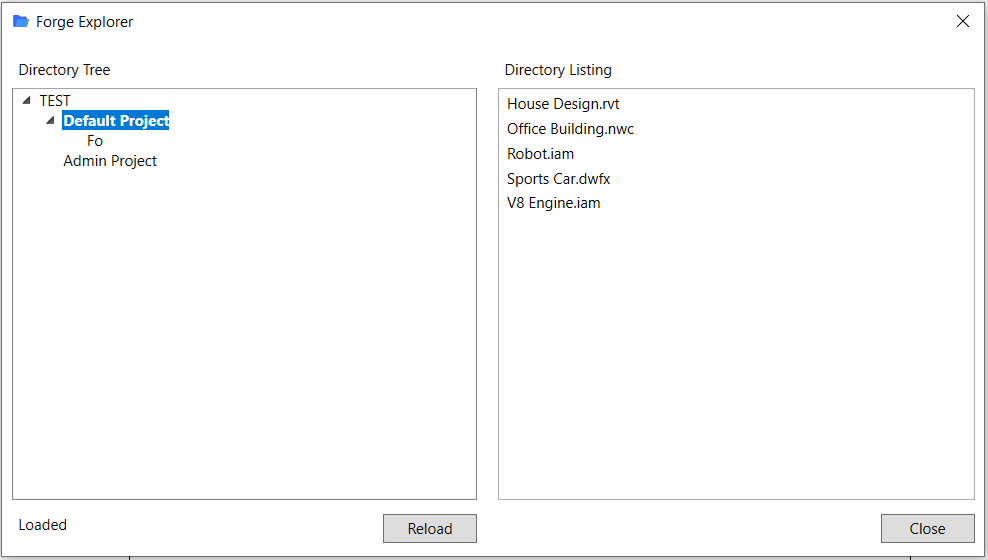

# ForgeExplorer

Revit add-in which use The Data Management API (from Autodesk Platform Services (APS) - formerly Forge) which provides a unified and consistent way to access data across BIM 360 Team, Fusion Team (formerly known as A360 Team), BIM 360 Docs, A360 Personal, and the Object Storage Service to explore this data from Revit.

## General

It is a study project to practice with WPF and MVVM pattern.

The inspiration and main idea of this tool is taken from Forge BIM360 Crawler from [Dynamo Multiplayer by Bird Tools](https://www.birdtools-developers.com/dmu.html) and [forge-viewhubs-desktop by Autodesk-Forge](https://github.com/Autodesk-Forge/forge-viewhubs-desktop)

It is based on Autodesk.Forge 1.1.0 and RestSharp 105.2.3. The main reason behind this particular versions is to avoid dependancy conflict with preinstalled in Revit 2020-2022 Dynamo which has a dependency to specified RestSharp version (the last unsigned version of RestSharp).

It use "SSONET.dll" from Revit root folder to get the current user authorization token for Autodesk Web Services.

## Thumbnail

## License

This sample is licensed under the terms of the [MIT License](http://opensource.org/licenses/MIT). Please see the [License](License.md) file for full details

Credit to [open folder icons created by kmg design - Flaticon](https://www.flaticon.com/free-icons/open-folder)